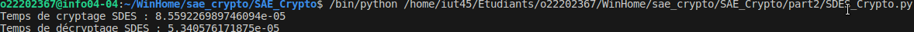

# SAE 3.04, Cryptographie partie 2.  
## Par LUDMANN Dorian et HAUDEBOURG Baptiste  

## Répartition des taches
| Tâche    | Sujet 1            | Partie 1                              | Partie 2     | Partie 3              | Partie 4 |
|----------|--------------------|---------------------------------------|--------------|-----------------------|----------|
| Dorian   | Ensemble du projet | Début de l'implémentation et markdown | Partie Image |                       | Q1, Q4 et Q5 |
| Baptiste |                    | Implémentation avancée du SDES        | Partie AES   | Ensemble de la partie | Q2 et Q3 |

## Partie 1  
### En supposant que RSA soit utilisé correctement, Eve peut-elle espérer en venir à bout? En vous appuyant sur votre cours, justifiez votre réponse.  
Si le RSA est utilisé correctement, Eve peut espérer en venir à bout à l'aide de la méthode brute force.  
Peu importe sa compléxité, il est possible de le décrypter. Cependant, plus sa compléxité est élevée, plus le temps de décryptage par brute force est important.  


### En quoi l’algorithme SDES est-il peu sécurisé? Vous justifierez votre réponse en analysant le nombre d’essai nécessaire à une méthode “force brute” pour retrouver la clé.  
Selon l'implémentation du [SDES en python](https://jhafranco.com/2012/02/10/simplified-des-implementation-in-python/), "il suffit, en moyenne, de seulement 512 essais afin de le décrypter", par le fait qu'il y ai seulement 2<sup>8</sup> possibilités unique sachant que la clé est codée sur 10 bits.  
L'algorithme SDES est donc très peu sécurisé par le fait que la force brute permet de "déchiffrer la clé en l'espace de quelques dixièmes de secondes".  


### Est-ce que double SDES est-il vraiment plus sur? Quelle(s) information(s) supplémentaire(s) Eve doit-elle récupérer afin de pouvoir espérer venir à bout du double DES plus rapidement qu’avec un algorithme brutal? Décrivez cette méthode astucieuse et précisez le nombre d’essai pour trouver la clé.  
Le double SDES est certes plus sécurisé qu'un chiffrage par SDES mais dans quelles mesures?  
- Contre un brut force, l'anciennement 2<sup>8</sup> possibilités se transforme désormais en 2<sup>8<sup>2</sup></sup> = 2<sup>64</sup> possibilités. Il faut donc en moyenne 9,2*10<sup>18</sup> essais en moyenne.
- Pourtant, sur un cassage astucieux, doubler le SDES est peu efficace, car contre sa variante brutale, où 2<sup>n</sup> est le nombre de possibilités d'encondage (avec n le nombre de cryptage par SDES), sur un cassage astucieux, le nombre d'itérations nécéssaire afin de décrypter le code est de 2n. Les 1024 possibilités deviennent 1024*2 = 2048, qui reste alors à moins d'une seconde d'éxécution pour décoder. En moyenne, il faudras alors 1024 essais pour décoder le message.
- D'un point de vue mathématiques, le double chiffrement par SDES créé un chevauchement lors du décodage, qui peut permettre de complexifier le déchiffrage.

Décodage astucieux par "Meet in the middle":
L'attaquant utilise un programme de déchiffrement qui se propagent des deux extrémités jusqu'au milieu du système, dans certains cas en devinant une partie de la clé. Si les événements ne correspondent pas au milieu, l'hypothèse de la clé est erronée et peut être jetée.
Ce principe provient de la théorie des graphes lorsqu'on essaye de relier deux sommets entre eux. Au lieu de faire un parcours simple depuis la racine, on fais un double parcours des deux cotés afin de transformer l'algorithme d'une compléxité de O(n<sup>2</sup>) à une compléxité de O(2n)

### Notre décodage SDES  
Pour ce qui est des fonctions de décodage SDES, nous en avons trois.
Ces trois fonctions reprennent notamment les principes évoqués précédemment afin de rendre le décryptage de plus en plus efficace, en terme de réussite comme en temps.
Nos trois fonctions sont alors:  
- cassage_brtual: Renvoie un set des résultats possible. Lent mais réussite assurée.  
-> 1.5sec/test
- cassage_astucieux: Renvoie un set des couples de clés possible. Rapide mais environ 50% de chance de réussite.  
-> 0.005sec/test
- cassage_astucieux2: Renvoie aussi un set des couples de clés possibles. Environ 2x plus lent que cassage_astucieux, mais 100% de réussite.  
-> 0.01sec/test  

Nos deux cassage_astucieux tente de reprendre le principe du "Meet in the Middle".  
  

Il est aussi important de noter la taille des sets renvoyés par nos fonctions. Malgrès le fait que celui peut paraitre conséquent, on dénombre en moyenne 256 couples de clés possible pour un encryptement par double SDES de taille de clé 8 (Soit 256 possibilités par clé). Sur les 65536 couples de clé1, clé2. On retourne alors 1/256<sup>ème</sup> des possibilités totale.  
  
Si jamais on souhaite trouver quelle clé est utilisé pour décoder un texte, on peut alors écrire une fonction qui test l'ensemble des 256 couples trouvé par cassage_astucieux pour ensuite appliqués les clés sur le texte et vérifier petit à petit que les mots formés appartiennent au dictionnaire français (anglais, etc).  

## Partie 2  
### Cryptographie et AES  

### 1. Est-ce vraiment un problème ? Justifiez votre réponse.  
Cela risque de devenir un problème, en effet la clé est désormais de taille 256 bits pour AES comparé à 64 pour le SDES. Cette nouvelle taille va rendre le décryptage par force un brut beaucoup plus long. Le temps de ce décryptage restera très long.

### 2. Nous allons tenter d'illustrer expérimentalement les différences entre les deux protocoles
Nous pouvons retrouver le temps de cryptage et de décryptage de chacun des algorithmes. On peut remarquer que le temps reste assez similaire et très faible, ainsi l'utilisation de AES au lieu de SDES permet d'obtenir une meilleure protection pour des coûts très faible.
  
Le temps d'exécution pour le chiffrement et déchiffrement d'un message pour le double SDES est de xxx, tandis que pour AES le temps est de xxxx pour l'exemple.  
Le temps de cassage que nous avons pu obtenir par force brut pour le double SDES est d'environ 3 secondes afin d'obtenir toutes les clés possibles.  
  
Cependant, avec AES ici nous obtenons 1 * 10 <sup>27</sup> de temps théorique, pour faire ceci nous avons réalisé des tests par force brut afin de trouver toutes les clés sur x nombre, nous avons ensuite récupérer ce temps afin de le faire correspondre à toutes possibilités enfin nous l'avons changé en année.


### 3. Il existe d'autre types d'attaques que de tester les différentes possibilités de clés. Lesquelles ? Vous donnerez une explication succincte de l'une d'elles.
Les autre moyens de décrypter la clé sont une solution en lien avec une amélioration de l'attaque par rencontre au milieu, une attaques par canal auxiliaire. Cette dernière dispose de beaucoup de sous possibilités d'attaque, cependant elle consiste à rechercher des failles dans le matériel, l'implémentation ou encore dans le logiciel. 

### Sténographie
Notre mission est de trouver une clé à l'aide des deux images données.  
La première hypothèse que nous avons pu émêttre est celle que les bits des pixels additionnés à la clé formait une équation de forme suivante: Image1 + Clé = Image2, soit Image2 - Image1 = Clé.  
Exemple: Si l'image un possède 4 pixels de valeurs (128, 172, 64, 152) et que les pixels de l'image2 possède 4 pixels de valeurs (129, 172, 64, 153), alors la clé serait égale à 1001.  
Or, cette première hypothèse ne c'est pas révélé correcte car nous avons pu nous apercevoir que si un bit de position x était égal à 1 dans l'image 1, et à 0 dans l'image 2, la clé devait être égale à 0.
La seconde hypothèse qui alors été formulée, et que la clé a trouver est lisible sur la concaténation des bits de poid faible de l'image 2.  
  
Suite à la sortie de la clé calculé, on a pu observer que des 1 apparaissent jusqu'au bit 61. Notre hypothèse parait nous parait alors validée suite à cette trouvaille. On en déduira aussi que la clé est codée sur 64 bits (8 octets).
Une fonction python a aussi été implémenté afin d'automatiser cette recherche.
```py
def comparaison_img(img_to_decrypt):
    # On retourne ici la clé sur 64 bits, mais la clé est print sur 128 bits dans le terminal afin de montrer que celle-ci est bien coder sur les 64 premiers bits
    i = Image.open(img_to_decrypt)
    string_clé = ""
    counter_boucle = 0
    for y in range(i.size[1]): #Colonne
        for x in range(i.size[0]): #Ligne
            counter_boucle += 1
            shade_of_grey = i.getpixel((x,y))
            string_clé += str(shade_of_grey%2)
            if counter_boucle >= 64:
                break
        if counter_boucle >= 64:
            break
    print("Key found:", string_clé)
    return string_clé[0:64]
```

## Partie 3

Tout d'abord, il faut récupérer la clé que l'on obtient par sténographie lors de la partie 2, que l'on dupliquera afin de la mettre sur 256 bits.  
Une fois cela fait, on va procéder à la récupération des informations présent dans la trace, une fois la trace récupérée, on va vérifier que le paquet correspond à un message UDP ainsi que le port correspondant au message soit bien 9999.  
Il faut ensuite récupérer les 16 premiers bits qui correspondent au message crypté, ainsi le reste correspondra au vecteur d'initialisation qui est créé aléatoirement au moment du cryptage du message.  
On peut alors, avec la clé, le message et le vecteur d'initialisation déchiffrer le message et obtenir le résultat. On peut remarquer que selon le système d'exploitation le résultat n'est pas le même, en effet sur Windows on trouvera un résultat composé d'emoji tandis que lorsque nous avons réalisé le travail sur xubuntu sur les machines de l'Iut ils n'apparaissaient pas. On suppose que l'encodage utf-8 est différent selon le système d'exploitation.  

## Partie 4
### Alice et Bob utilisent toujours la même clé. Est-ce une bonne pratique?  
Non! Si jamais la clé venait a ce faire déchiffrer, alors leurs messages seraient toujours décryptable et mettrais alors en danger leurs vie privés.  
Une méthode courante et de changer la clé à chaque message, afin de ne pas corrompre la sécurité des échanges même après décryptage d'un message.  

### Le protocole PlutotBonneConfidentialité est inspiré d’un vrai protocole réseau. Lequel? Décrivez la partie associé à la certification des clés qui est absente de PlutotBonneConfidentialité.  
Le protocole PlutotBonneConfidentialité est inspiré du protocole SSL. Il s'agit d'un protocole permettant la sécurisation des communications, il doit utiliser une certification des clés afin de pouvoir s'assurer que la communication est sécurisé. Cette certification nécessite plusieurs étapes, notamment la création d'une clé asymétrique contenant une clé publique et privée, une demande de certification qui doit être validé par une autorité de certification. Enfin, on pourra utiliser ce certificat pour communiquer.

### Il n’y a pas que pour l’échange de mots doux q’un tel protocole peut se révéler utile... Donnez au moins deux autres exemples de contexte où cela peut se révéler utile.  
En effet, on peut utiliser ce protocole sur les sites internet, il reste important que les transmissions de données restent sécurisées, ainsi l'utilisation de ce protocole peut correspondre au besoin des sites internet. De plus, il peut être utilisé pour la transmission de message comme vu précédemment mais aussi sur des mails, si l'on trouve le besoin de réaliser un mail sécurisé par exemple.  

### Connaissez-vous des applications de messagerie utilisant des mécanismes de chiffrement similaires? Citez-en au moins deux et décrivez brièvement les mécanismes cryptographiques sous-jacent.  
Le chiffrement E2EE (end to end encryption) est un type d'enchiffrement qui permet de rendre le message accessible seulement aux utilisateurs participants. Personne d'autre ne peut y avoir accès, même l'host du service de communication, ne peut retrouver les messages d'origine.  
Snapchat est l'exemple le plus connu, mais on retrouve aussi les géants de l'informatique comme google et son application "Google Messenger".  
Son fonctionnement est simple, au lieu de décrypter le message en cours de route, c'est seulement au moment de son arrivée que celui-ci le sera. Ce qui change, c'est que le serveur transit ne peut donc connaitre le contenu du message.  
Exemple | Bob souhaite envoyer un message à Alice en passant par le serveur transit S_t. Bob crypte alors son message avec la clé publique d'Alice. Le message passe alors par S_t et Alice recoit un message illisible. Une fois reçu, elle peut alors utiliser sa clé privée pour pouvoir décoder le message que Bob lui a envoyé.  

### Récemment, différents projets de loi et règlements (CSAR, EARN IT Act) visent à inciter voir obliger les fournisseurs de services numériques à pouvoir déchiffrer (et donc analyser) les communications de leur.e.s utilisateur.rices. Discutez des arguments en faveur ou contre ces législations, notamment en matière de vie privée.  
Ces projets de lois ont pour but de lutter contre les infractions en ligne, notamment pour aider à la lutte du terrorisme.  
Le but de ses projets de lois est de pouvoir déchiffrer les messages afin de comprendre les circonstances d'évènements passé, ainsi que d'aider à éviter des attaques futures.  
Malgrés le fait que ces projets mettent en jeu la vie privée des utilisateurs, celui-ci se doit de consentir qu'il n'as rien à se reprocher avant de pouvoir utiliser la plateforme. De plus, l'extraction des messages décryptés se doit d'être fait dans un cadre légal.  
Pourtant, cela ne change pas le fait qu'un hacker, ou qu'une personne ayant accès aux ressources de la base de donnée, puisse se permettre de déchiffrer l'ensemble des conversations.  
C'est à cause de cette éventualité que ces projets de loi ne sont encore que projets, et que la population porte débat sur le rendement entre sécurité et liberté.  

### Par Ludmann Dorian et Haudebourg Baptiste 2A1